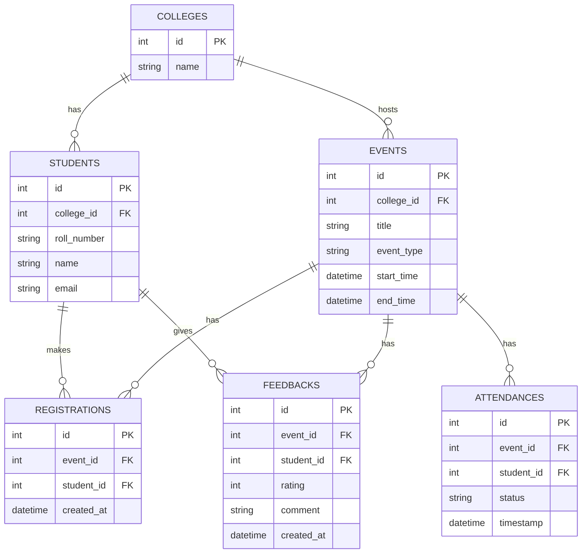

# Design Document — Campus Event Reporting (Prototype)

## 1) Scope & Focus
Build a minimal reporting layer for a Campus Event Management Platform with:
- Admin (create events)
- Student (register, check-in, submit feedback)
- Reports (registrations, attendance %, avg feedback; popularity; participation; top students)

## 2) Assumptions
- Multi-tenant: **one shared DB**, data scoped by `college_id` (simpler operations + easier cross-college analytics).
- IDs are globally unique. Event and Student belong to a College; cross-college registration is blocked.
- A student can submit **one** registration, **one** attendance record, **one** feedback per event.
- Attendance records are only created for **present** students (absent = lack of attendance row).
- Feedback rating is an integer in `[1..5]`.

## 3) Data to Track
- Event: `id, college_id, title, event_type, start_time, end_time`
- Student: `id, college_id, roll_number, name, email`
- Registration: `id, event_id, student_id, created_at`
- Attendance: `id, event_id, student_id, status, timestamp`
- Feedback: `id, event_id, student_id, rating, comment, created_at`

## 4) ER Diagram (Mermaid)

## 5) API Design (Major Endpoints)
- `POST /colleges` → create college
- `POST /students` → create student
- `POST /events` → create event
- `POST /events/{id}/register` → register student
- `POST /events/{id}/attendance` → mark attendance (present)
- `POST /events/{id}/feedback` → submit rating + comment

**Reports**
- `GET /reports/event/{id}/stats` → registrations, attendance %, avg feedback
- `GET /reports/event-popularity?college_id=&event_type=` → registrations per event (sorted)
- `GET /reports/student-participation?college_id=` → attended count per student (desc)
- `GET /reports/top-active-students?college_id=&limit=3` → top N

## 6) Workflows
**Registration → Attendance → Reporting**
1. Admin creates Event.
2. Student registers (enforced uniqueness).
3. On event day, scan/check-in marks attendance.
4. After event, student submits feedback.
5. Reports query aggregates.

## 7) Edge Cases
- Duplicate registration/attendance/feedback → blocked via unique constraints.
- Student and Event from different colleges → 400.
- Missing feedback → avg feedback returns `null`.
- No registrations → attendance % = 0.0.

## 8) Scale Notes (50 colleges × 500 students × 20 events/semester)
- Single DB is fine; add indexes on `college_id`, `event_id`, `student_id`.
- For higher scale: move to Postgres, introduce pagination, background analytics jobs, caching.

## 9) Testing & Data
- `scripts/init_db.py` seeds sample data.
- `tests/http_samples.http` contains quick requests.
